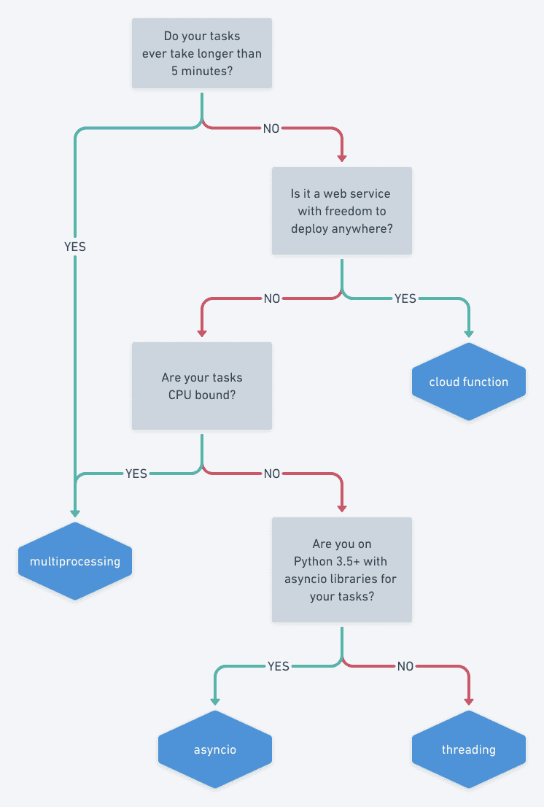

# Making lunch faster with Python concurrency

原文：[https://sourcery.ai/blog/concurrency/#options](https://sourcery.ai/blog/concurrency/#options)（译：[@lesywix](https://github.com/lesywix)）

---

# 介绍

我将来通过一个故事来介绍 python 中并发（concurrency）与并行（parallelism）。

在这个故事中我们将会看到”一个人“是如何通过并发的方式来处理多个任务；”多个人“是如何通过并行的方式来处理任务。我们会通过一个非常常见的场景：午餐时间餐厅服务员是如何快速高效地服务他们的客户，进而到 python 需要如何实现这两种方式。最后我将会对比并发和并行的区别并解释什么时候应该用哪个比较好。

在这篇文章我将会解释：

- 并发和并行的区别
- 实现并发的方式及他们的不同之处，包括 `threading, asyncio, multiprocessing, 和 cloud functions`
- 实现并发方式的优点和缺点
- 使用一张图来解释如何选择并发的方式

# 什么是并发(concurrency)？什么是并行(parallelism)？

让我们先以他们的定义来开始：

> 如果一个系统可以在同一时刻支持两个或多个进行中的任务（process），那这个系统就可以说是并发的。

> 如果一个系统能同时执行两个或多个以上的任务（simultaneously），那这个系统就可以说是并行的。

> 两者的关键区别在于”进行中“（process）

这里补充一个🌰帮助理解：假设现在有两个任务，吃蛋糕和唱歌。
对于并发的情况，由于你只有一张嘴（单核 CPU。当然，你也可以多核，这里只是用单核举个例子），为了同时执行两个任务，你可以先吃一口蛋糕，然后马上唱歌，又马上吃蛋糕（同一过程）。
对于并行的情况，你就有两张嘴了（意味着单核 CPU 是无法并行的），你可以用一张嘴吃蛋糕，一张嘴唱歌。

现在我们回到我们的故事。

在午餐时间，你走进了一条从未去过的街，里面有两家餐厅：并发汉堡王，并行沙拉酱。两个餐厅看起来都挺美味但是都排了好长的队，所以你在想哪家搞的比较快。

并发汉堡王由一名身纹大蟒蛇的中年妇女经营，她正在执行以下任务：

- 帮顾客点菜
- 煎饼
- 将沙拉，肉饼，调味品都整合到一起，然后完成这个订单

她可以在任务间无缝切换。一会她正检查这烤架上的肉饼，然后帮顾客点菜，接着如果肉饼好了她就整合汉堡完成订单。

并行沙拉酱则配备了许多员工，每个员工都为每个顾客准备沙拉。员工们有的为顾客下单，有的制作沙拉，有的洗碗。

两家店最主要的不同点是员工的数量和任务执行的方式：

- 并发汉堡王在重叠的时间段内有多个正在进行的任务（但不是同时进行），并且有一个在切换任务的工人。
- 并行沙拉酱能同时执行多个任务，并且有多个工人能在同一时间执行一个任务。

你观察到两家餐厅都能以同样的速率服务他们的顾客。蟒蛇女能同时制作多个汉堡，但受到煎饼速度的限制。沙拉酱雇了多个员工能同时制作一个沙拉，但是受到将沙拉材料放在一起的时间长短的限制。

你意识到了并发汉堡王是 I/O 密集型，并行沙拉酱是 CPU 密集型：

- I/O 密集型是指程序受到 I/O 的限制，从计算机的角度来说就意味着从磁盘读取数据或者进行网络请求。在汉堡王的角度就是煎饼时间。
- CPU 密集型是指程序受到 CPU 速度的限制。如果 CPU 速度更快那程序执行的速度也会更快。在沙拉酱的角度就是工人制作沙拉的速度。

纠结的你已经在两家店之间徘徊了许久，这时候一个长者打断了你，并邀请你来加入他那边的队列。

注意：并发沙拉酱是并发的，但同时也是并行的，因为”在同一过程执行了两个或多个任务“。并发是并行的子集。

下面我们将会来讲讲在 python 中是如何实现这两种方法的。

## 有哪些方案

python 有两种方法来实现并发

- threading
- asyncio

有一种方法来实现并行

- multiprocessing

不过如果你的程序是云程序，还有一种实现并行的方法

- cloud functions

# 并发实战

让我们来看看如何使用 threading 和 asyncio 这两种方式来实现并发。两种方式都是只有一个工人来下单，煎饼和整合汉堡。

在 threading 和 asyncio 中，都只有一个处理器在执行任务，这个处理器需要在执行不同任务之间进行跳转。threading 和 asyncio 的区别在于如何决定哪个任务将会被切换并被处理器执行。

- 在使用 threading 时，操作系统知道你运行的不同线程，并且会在合适的时候打断他们的执行并切换到不同的任务。程序本身并不会控制这些。这就叫做抢占式多任务处理（pre-emptive multitasking）因为操作系统来抢占你的线程并且进行线程的切换。在多数的编程语言中，多线程是并行的，但是在 python 中多线程每次只会执行一个（GIL 锁）
- 在 asyncio 中，由程序来决定什么时候来切换任务。每个任务都会在准备切换时放弃控制权，从而与其他任务互相协作。因此，这也叫做协同多任务处理（cooperative multitasking），因为当一个任务卡住的时候，他必须放弃控制权来进行协作。

## 用 threading 实现汉堡王

通过 threading 的方式，worker 在执行中的任何时候来切换任务。这个 worker 在点餐的时候，可能会突然切换去煎饼，或者做汉堡，然后再回来点餐。让我们来看看如何使用 threading 实现汉堡王：

```python
from concurrent.futures import ThreadPoolExecutor
import queues

# 注意：一些方法和变量省略了，我们只关注 threading 的细节

def run_concurrent_burgers():
    # 创建阻塞队列
    customers = queue.Queue()
    orders = queue.Queue(maxsize=5)  # 一次最多处理 5 个订单
    cooked_patties = queue.Queue()

		# grill 可以看成是一个耗时任务，将生饼煎成熟饼
    grill = Grill()

    # 使用 thread pool executor 执行三个任务
    with ThreadPoolExecutor() as executor:
        executor.submit(take_orders, customers, orders)
        executor.submit(cook_patties, grill, cooked_patties)
        executor.submit(make_burgers, orders, cooked_patties)

def take_orders(customers, orders):
    while True:
        customer = customers.get()
        order = take_order(customer)
        orders.put(order)

def cook_patties(grill, cook_patties):
    for position in range(len(grill)):
        grill[position] = raw_patties.pop()

    while True:
        for position, patty in enumerate(grill):
            if patty.cooked:
                cooked_patties.put(patty)
                grill[position] = raw_patties.pop()

        # 一分钟之内不要再检查是否煎好饼
        threading.sleep(60)

def make_burgers(orders, cooked_patties):
    while True:
        patty = cooked_patties.get()
        order = orders.get()
        burger = order.make_burger(patty)
        customer = order.shout_for_customer()
        customer.serve(burger)
```

下单，煎饼和制作汉堡的每个任务都是一个无限循环，不断地来执行任务。

在 `run_concurrent_burgers` 中，我们在一个单独的线程中启动每一个任务。我们可以为每一个任务手动创建一个线程，但是 python 有个更好的接口，叫做 `ThreadPoolExecutor` ，他为提交给他的每个任务都创建一个线程。

当使用多线程时，我们必须确保每次只有一个线程正在读或者写任何变量（状态）。否则可能会出现这样的情况：两个线程同时拿了一块饼（变量），这会导致顾客非常生气。这个问题称为线程安全。

为了避免这个问题，我们使用队列来传递变量（队列是原子操作，线程安全）。在各个任务中， 当调用 get 的时候队列 Queues 会阻塞，直到客户队列，订单队列或煎饼队列都准备好为止。操作系统不会尝试去切换到任何已经阻塞的线程，这为我们提供了一种简单安全切换状态的方式。 一个线程不再使用该变量（状态）后，只要将变量（状态）放入到 Queue 中，那么获得该变量的线程就知道在使用这个变量的时候该变量不会被其他线程更改。

### threading 优势

- I/O 不会阻塞其他任务的执行
- 强大的 python 库支持，只要能以单线程的方式执行，基本上都可以使用多线程执行

### threading 劣势

- 由于操作系统切换线程的开销，速度会比 asyncio 慢
- 线程不安全
- 对于 CPU 密集型任务（比如制作沙拉）没有多大帮助（由于 GIL 锁），一个工人同时做多个沙拉并不会比他们一个接着一个做快多少。

## 用 asyncio 实现汉堡王

在 asyncio 中，有一个 event loop 来管理所有任务。多个任务可以处在许多不同的状态，其中最重要的两个状态是就绪（ready）和等待（waiting）。在每次循环中，event loop 都会检查是否有任务由于其他任务执行完毕而从等待状态切换到就绪状态，接着 event loop 就会挑选等待状态的任务并执行它直到完成任务或者需要等待另一个任务完成为止，比如 I/O 操作。

有两个关键词覆盖了 asyncio 的大部分用法：async 和 await。

- async 用来标记一个函数必须作为单独的一个任务来执行
- await 创建一个新的任务并且交出控制权给 event loop。它将任务置为等待状态，且当任务完成后，就会再次回到就绪状态

让我们来瞧瞧如何用 asyncio 来实现汉堡王：

```python
import asyncio

# 注意：一些方法和变量省略了，我们只关注 asyncio 的细节

def run_concurrent_burgers():
    # 这些队列放弃控制权
    customers = asyncio.Queue()
    orders = asyncio.Queue(maxsize=5)  # 一次最多处理 5 个订单
    cooked_patties = asyncio.Queue()

		# grill 可以看成是一个耗时任务，将生饼煎成熟饼
    grill = Grill()

    # 使用默认的 asyncio event loop 执行所有任务
    asyncio.gather(
        take_orders(customers, orders),
        cook_patties(grill, cooked_patties),
        make_burgers(orders, cooked_patties),
    )

# 使用 async def 来声明这是 asyncio 任务
async def take_orders(customers, orders):
    while True:
        # 在所有 await 处都允许切换到其他任务
        customer = await customers.get()
        order = take_order(customer)
        await orders.put(order)

async def cook_patties(grill, cooked_patties):
    for position in range(len(grill)):
        grill[position] = raw_patties.pop()

    while True:
        for position, patty in enumerate(grill):
            if patty.cooked:
                # put_noawait 允许我们在不创建新任务和放弃控制权的情况下添加到队列中
                cooked_patties.put_noawait(patty)
                grill[position] = raw_patties.pop()

        # 等 30 秒再来检查
        await asyncio.sleep(30)

async def make_burgers(orders, cooked_patties):
    while True:
        patty = await cooked_patties.get()
        order = await orders.get()
        burger = order.make_burger(patty)
        customer = await order.shout_for_customer()
        customer.serve(burger)
```

下单，煎饼和制作汉堡的每个任务都是用 async def 来声明的。

在这些任务中，每次调用 await 时，worker 都会切换到一个新的任务。将会发生如下情况：

- 在下单时
    - 当你要跟下一个顾客沟通时
    - 当你将订单加入订单队列时
- 在煎饼时
    - 当所有的饼都已经检查
- 在制作汉堡时
    - 当你在等饼熟
    - 当你在等待订单
    - 找到顾客并给他们汉堡

最后一个问题是在 `run_concurrent_burger` 中，它调用 `asyncio.gather` 去调度 event loop 运行所有任务，在本例中，event loop 就是我们的工人（服务员）。

我们已经知道，当任务切换的时候，并不需要去关注共享变量。我们可以仅仅使用列表队列，因为我们知道两个任务不会同时处理同一个煎饼。但是，我们强烈建议使用 asyncio Queues，因为它能提供合理的暂停任务的点，使我们能非常轻松地在任务之间进行协作。

使用 asyncio 的一个有趣的方面是 `async` 关键字会改变该函数，使他不能直接从非异步函数中调用。这可以看成是一件好事也可以看成是坏事。一方面，你可能会说这样损害了可组合性，因为你无法将异步函数和和正常的函数混在一起。另一方面，如果 asyncio 仅用于 I/O，则会强制将 I/O 与业务逻辑分离开，把 asyncio 代码限制在应用的一边，使得代码更容易理解和测试。在强类型语言中，显式标记 I/O 是相当普遍的做法 — 在 Haskell 中是必须的。

### asyncio 的优点

- 对 I/O 密集型处理相当快
    - 由于只有一个系统线程，所以开销比多线程少
    - 所有最快的 web 框架都是使用 asyncio — 可以查看 [benchmarks](https://www.techempower.com/benchmarks/#section=data-r19&hw=ph&test=fortune&l=zijzen-1r)
- 线程安全

### asyncio 的缺点

- 对于 CPU 密集型没有太大帮助
- 这个 feature 是最近几个 python 版本才加入的
    - 需要 python 3.5 +
    - 一些库还不支持 asyncio

# 并行实战

并行沙拉酱有多个工人并行制作沙拉，我们将使用 multiprocessing 来实现它。

然后我们可以到云咖啡厅去看看 cloud functions 是如何实现并行任务的。

## 用 multiprocessing 实现沙拉酱

并行沙拉酱中的每一个 worker 都由操作系统产生的一个新进程来表示。这些进程是通过 `ProcessPoolExecutor` 来创建的，并通过它来分配任务。

```python
import multiprocessing as mp
from concurrent.futures import ProcessPoolExecutor

# 注意：一些方法和变量省略了，我们只关注 multiprocessing 的细节

def run_parallel_salads():
    # 创建 multiprocessing 队列，可进行跨进程通信 
    customers = mp.Queue()
    bowls = mp.Queue()
    dirty_bowls = mp.Queue()

    # 使用 process pool executor 来运行并行任务
    with ProcessPoolExecutor(max_workers=NUM_STAFF) as executor:
        # 设置 NUM_STAFF - 1 人做沙拉
        for _ in range(NUM_STAFF - 1):
            executor.submit(make_salad, customers, bowls, dirty_bowls)

        # 设置一个工人洗碗
        executor.submit(wash_bowls, dirty_bowls, bowls)

def make_salad(customers, bowls):
    while True:
        customer = customers.get()
        order = take_order(customer)
        bowl = bowls.get()
        bowl.add(ingredients)
        bowl.add(dressing)
        bowl.mix()
        salad = fill_container(bowl)
        customer.serve(salad)
        dirty_bowls.put(bowl)

def wash_bowls(dirty_bowls, bowls):
    while True:
        bowl = dirty_bowls.get()
        wash(bowl)
        bowls.put(bowl)
```

通过 `multiprocessing` ，每一个任务都运行在单独的进程中。这些进程通过操作系统来并行运行，彼此不阻塞。并行运行的进程数量收到 CPU 核心数的限制，所以我们将把制作沙拉的 worker 限制在这个范围内。

由于这些任务处在不同的进程中，他们不共享任何变量（状态），每个进程都有一个完整的变量副本。所以我们必须使用 multiprocessing 队列来在他们之间进行通信。

### 题外话 - asyncio 和 multiprocessing

一种用 multiprocessing 的用例是在 asyncio 应用程序中卸除 CPU 密集型任务，以防止这些任务阻塞程序其他地方，下面是一个简单的示例：

```python
import asyncio
from concurrent.futures import ProcessPoolExecutor

process_pool = ProcessPoolExecutor()  # 默认的 worker 数是 CPU 核心数

async def handle_long_request(n):
    event_loop = asyncio.get_running_loop()
    # calculate_n_pi 将在一个单独的进程中运行，使得 asyncio event loop 继续并行处理其他异步任务
    return await event_loop.run_in_executor(process_pool_executor, calculate_n_pi, n)

def calculate_n_pi(n):
    threading.sleep(60)
    return n * 3.14
```

### Multiprocessing 优点

- 加快 CPU 密集型任务的处理
- 线程安全
- 可以从 web server 进程中独立出新进程来处理长时间的运算（CPU 任务）

### Multiprocessing 缺点

- 进程间不共享资源
- 高开销 - 对 I/O 密集型任务没帮助

## 云咖啡厅与 Cloud Functions

（注：此处省略了一些不重要的原文内容）

午饭后，你们打算到云咖啡厅瑞上一杯。在云咖啡厅里，每个人都会被分配一个单独的摊位，各个顾客可以完全不用理会其他摊位。你下单后，咖啡师会做好咖啡端给你。如果突然有一堆人来咖啡厅，则在短暂的等待后，会有更多的摊位出现，等订单完成后，摊位则又会消失在云端。

你朋友要求奇特，下了一个复杂的订单，咖啡师做着做着突然就毫不客气地将咖啡丢进垃圾桶，并对他喊”超时了！“

如果你要写一个 web 服务，则使用 Cloud Functions 是一个值得考虑的选项。每次只需要实现一个订单的功能，可以完全忽略并发性。

```python
def cloud_coffees(order):
    ground_coffee = grind_beans()
    coffee = brew_coffee(ground_coffee)
    coffee.add_embellishments(order)
    return coffee
```

每个请求都由一个实例来实现，当没有请求时，实例会被回收。每个请求都有超时时间，所以你的任务必须在超时前完成，否则实例将会消失而不会完成。

实例与实例之间无法通信，且永远不要在实例中存储任何状态，因为实例可能会随时消失。

最常见的实现是 AWS Lambda，Azure Functions 和 Google Cloud Functions。

### Cloud Functions 优点

- 极其简单的模型
- 比运行在一个持久服务器便宜
- 无痛扩展

### Cloud Functions 缺点

- 启动新实例会有延迟
- 请求有超时限制
- Python 版本有限 - 只能使用云服务商提供的版本

# 你应该用哪个方案

让我们来把上面提到的方法都总结到一个表里:

|                          | **threading**                                  | **asyncio**                                    | **multiprocessing**                                | **cloud functions**                   |
| ------------------------ | ---------------------------------------------- | ---------------------------------------------- | -------------------------------------------------- | ------------------------------------- |
| **并发类型**             | 抢占式                                         | 协同式                                         | 多进程                                             | 多实例                                |
| **并发** **or** **并行** | 并发                                           | 并发                                           | 并行                                               | 并行                                  |
| **是否显式并发控制**     | 否                                             | 是                                             | 否                                                 | 否                                    |
| **切换决策**             | 由操作系统决定何时切换任务                     | 由任务决定何时放弃控制权                       | 进程同时在不同的 CPU 内核中运行                    | 进程在不同的实例中运行                |
| **最大并行数**           | 1                                              | 1                                              | CPU 核心数                                         | 无限制                                |
| **任务间通信**           | 共享状态                                       | 共享状态                                       | Multiprocessing 队列和返回值                       | 不可能通信                            |
| **是否线程安全**         | 否                                             | 是                                             | 是                                                 | 是                                    |
| **适合场景**             | I/O 密集型                                     | I/O 密集型                                     | CPU 密集型                                         | CPU 密集型，且需在超时限制内(~5 分钟) |
| **任务开销**             | 每一个线程都需要消耗内存，且线程切换会消耗时间 | 开销很小，所有任务都在单进程，单线程的方式运行 | 每一个进程任务都会比线程消耗更多内存和进程切换时间 | 启动新实例会有延迟成本                |

到此为止，你已经了解了所有的选项，那么你就能很容易地选择一个了。

在此之前，你应该再仔细检查一下是否真的需要加速你的任务。如果它每周只运行一次，并且只需要十分钟，那是否真的需要加速呢？

我们可以参考下面的流程图：

